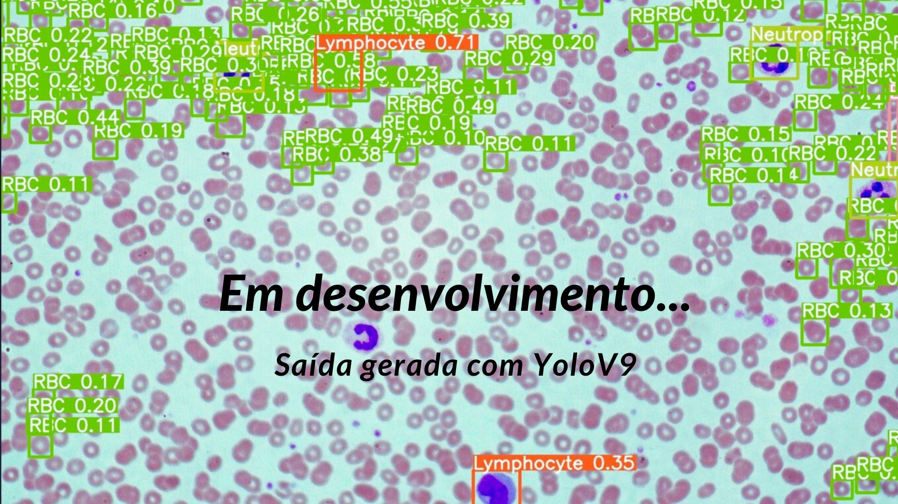
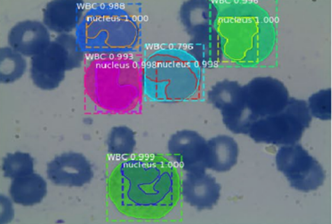
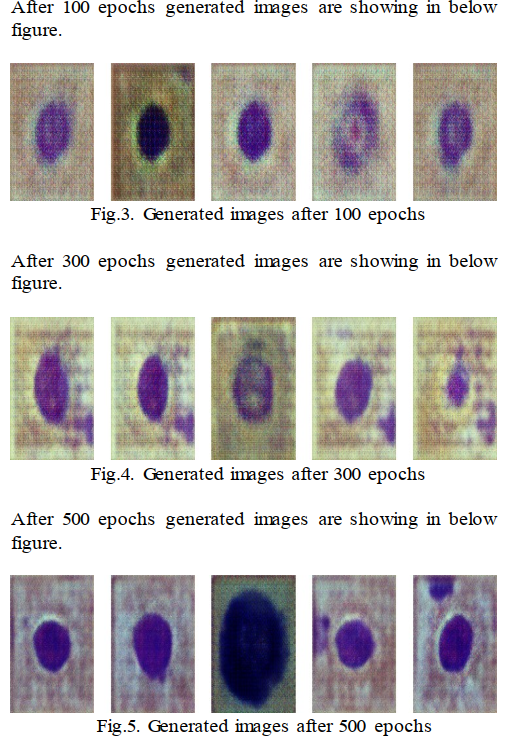
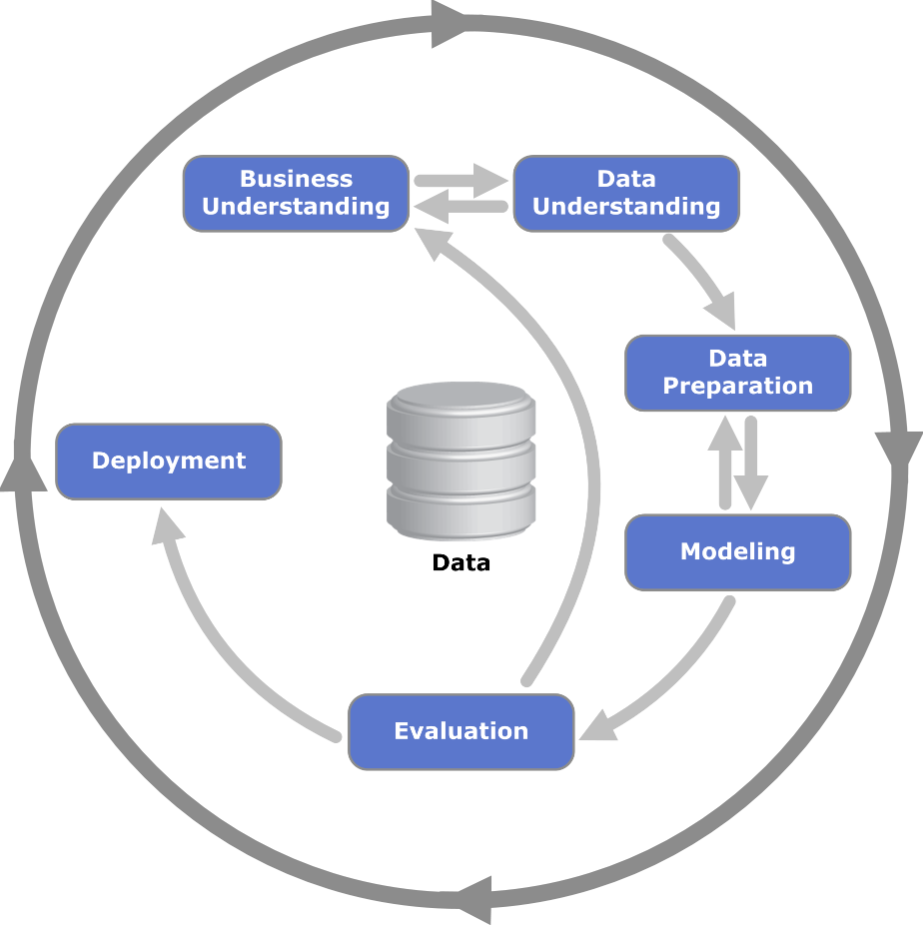

# Projeto de Mestrado: Desenvolvimento de um framework de redes neurais para análise de imagens de microscopia de esfregaço sanguíneo.

Compartilhando um pouco mais sobre meu projeto de mestrado na [**UFCSPA**](https://ufcspa.edu.br/vida-academica/pos-graduacao/mestrado-e-doutorado/tecnologias-da-informacao-e-gestao-em-saude): *Desenvolvimento de um framework de redes neurais para análise de imagens de microscopia de esfregaço sanguíneo.* . Esse projeto é pessoalmente importante para mim e acredito que possa ter um impacto significativo na automação das análises clínicas, especialmente na hematologia.

## 🩸 O Desafio

Laboratórios de pequeno porte e regiões carentes ainda dependem de métodos manuais para a **contagem e classificação de leucócitos** em hemogramas — processos **demorados, custosos e suscetíveis a erros**. Além disso, equipamentos automatizados são inacessíveis para muitos, perpetuando desigualdades no acesso a diagnósticos precisos.

No livro _"Hemograma: Manual de Interpretação"_, de **Renato Failace**, amplamente utilizado como referência acadêmica, há uma passagem em que o autor descreve a prática de _"hemograma no ato"_, possibilitando a realização do exame durante a própria consulta. Quem sabe, com um desenvolvimento mais aprofundado deste projeto, essa prática possa se tornar viável a um custo acessível, especialmente na **medicina veterinária**, onde o acesso ao hemograma não é tão fácil quanto nos grandes complexos hospitalares.

### Lacunas na área

No cenário atual brasileiro, algumas empresas já oferecem diagnóstico ou apoio ao diagnóstico por meio de inteligência artificial (IA), porém esses modelos têm como foco principal a integração com sistemas PACS, sendo aplicados em imagens de radiografia, tomografia e ressonância magnética. Até o momento, não há modelos de visão computacional implementados com foco em análises clínicas laboratoriais.

Embora já existam estudos experimentais com modelos de segmentação, classificação e contagem de leucócitos, esses trabalhos ainda não se consolidaram como tecnologias viáveis para ambientes de produção e acessíveis à população em geral.

Revisões sistemáticas, como as de S. Khan et al. (2022), Aggarwal (2021) e Asghar et al. (2024), apontam que a aplicação da IA em análises clínicas ainda enfrenta diversos desafios, como a escassez de bases de dados robustas, a necessidade de alto nível técnico para o desenvolvimento dos modelos e, especialmente, a implementação prática dessas soluções na rotina laboratorial — aspecto que este projeto se propõe a investigar.

## 🔬 A Solução

O objetivo deste projeto é desenvolver um modelo baseado em **redes neurais convolucionais** (testando e validando diferentes arquiteturas) para **segmentar, contar e classificar células sanguíneas** a partir de imagens microscópicas, com foco inicial em leucócitos (WBC).

> *Detecção, classificação e segmentação de células brancas. Fonte: Khouani et al. (2020).*

Equipamentos como o **CellaVision® DM1200** já são capazes de executar tarefas semelhantes, porém, o custo dessa tecnologia ainda é elevado e inacessível para muitas instituições. 

Neste projeto, o modelo será treinado utilizando **conjuntos de dados públicos**, possivelmente complementados por imagens obtidas com o [**CellaVision DM96**](https://data.mendeley.com/datasets/snkd93bnjr/1), o que contribuirá para uma maior confiabilidade dos resultados.

Considerando que a **disponibilidade de bases de dados robustas e confiáveis** é um dos principais desafios apontados na literatura para o treinamento de modelos de IA em análises clínicas, este projeto também levanta a hipótese de **gerar imagens sintéticas** utilizando **modelos de _Deep Convolutional Generative Adversarial Networks_ (DCGANs)**. 

Apesar de ainda estarem em estágio de desenvolvimento, esses modelos apresentam **grande potencial** para criação de datasets mais abrangentes, com menor viés e **menos implicações éticas** relacionadas ao uso de dados reais.
 

[White Blood Cell Image Generation using Deep Convolutional Generative Adversarial Network](https://ieeexplore.ieee.org/document/10010838)

A validação será feita por meio de **métricas robustas** (_precisão, recall, F1-Score_) e com a **avaliação de profissionais da área**, visando alcançar pelo menos **90% de acurácia**.

A partir do desenvolvimento de um modelo capaz de executar as tarefas descritas a proposta é que esse sistema se comporte como um **equipamento laboratorial**, sendo possivel seu interfaceamento e integração com **sistemas laboratoriais (LIS)** semelhante ao método já utilizado na maioria dos laboratorios que possuem um sistema LIS. A imagem será processada pelo modelos e os resultados serão entregues em **JSON (ou ASTM/HL7)**, agilizando essa etapa da análise laboratorial.

## 📈 Impacto Esperado

✔ **Redução de custos**: A automação de exames possibilita que **laboratórios com recursos limitados** realizem análises de forma mais eficiente e com menor necessidade de infraestrutura sofisticada. Além disso, a execução desse processo em **ambientes de computação em nuvem**, aliada a tecnologias de conectividade via satélite como a **Starlink**, torna viável a realização de **diagnósticos rápidos e precisos em regiões remotas** ou comunidades carentes, onde o acesso à saúde ainda é limitado.

✔ **Soberania tecnológica**: É essencial que **desenvolvamos nossas próprias soluções tecnológicas**, seja na esfera pública ou privada. Na área da saúde, isso significa **garantir a soberania dos dados** dos pacientes, reduzindo a dependência de soluções estrangeiras e promovendo a segurança da informação. Este projeto propõe uma solução **100% nacional**, com potencial para futuras aplicações em **dispositivos médicos in vitro**, como parte de um possível **hemograma digital**, alinhado a estratégias de inovação e autonomia tecnológica.

✔ **Democratização do acesso à saúde**: Ao combinar inteligência artificial com equipamentos acessíveis e infraestrutura digital, este projeto tem o potencial de **democratizar o acesso a exames laboratoriais básicos**, especialmente em locais onde o número de profissionais especializados é limitado. A implementação de sistemas automatizados pode **ampliar a cobertura diagnóstica**, contribuindo para a **detecção precoce de doenças** e o fortalecimento da atenção primária à saúde. 

## 📌 O Programa e os Próximos Passos

A metodologia escolhida para o desenvolvimento do modelo é o **CRISP-DM**, com adaptações necessárias para atender tanto às exigências de um **produto tecnológico** quanto aos requisitos acadêmicos de uma dissertação. O CRISP-DM é um modelo de processo amplamente adotado em projetos de mineração de dados e ciência de dados. Ele fornece uma estrutura padronizada e flexível que orienta o desenvolvimento de soluções baseadas em dados, desde a compreensão do problema até a implantação do modelo. Seu foco está na conexão entre os objetivos do negócio e a análise técnica, permitindo uma abordagem iterativa e adaptável a diferentes setores e desafios.

O projeto está sendo desenvolvido na [**Universidade Federal de Ciências da Saúde de Porto Alegre (UFCSPA)**, dentro do programa de **Tecnologias da Informação e Gestão em Saúde (TIGSAÚDE)**](https://ufcspa.edu.br/vida-academica/pos-graduacao/mestrado-e-doutorado/tecnologias-da-informacao-e-gestao-em-saude), na linha de pesquisa em [**sistemas inteligentes e aplicações na saúde**](http://dgp.cnpq.br/dgp/espelhogrupo/2437746416727738).

O programa tem um caráter **interdisciplinar**, proporcionando contato com profissionais de diversas áreas da saúde, como **médicos, gestores e especialistas de diferentes formações**, desde **física médica** até **fonoaudiologia**. Essa interação amplia a visão sobre os desafios da saúde e as tecnologias envolvidas.

A matriz curricular do curso permite aprofundar o conhecimento sobre **novas tecnologias e suas aplicações no setor da saúde**, por meio de disciplinas como:

- **Desenvolvimento de Softwares Baseado em Evidências**  
- **Tópicos Avançados em Tecnologias da Informação e Gestão em Saúde**  
- **Fundamentos da Inteligência Artificial Aplicada à Saúde**  

Ao final do projeto, a intenção é **disponibilizar o código-fonte no GitHub**, sob **licença Creative Commons**, incentivando a colaboração acadêmica e a adaptação pela comunidade.  

## 🤝 Vamos conversar?

Se você trabalha com **IA aplicada à saúde**, **análise de imagens médicas** ou tem interesse em colaborar, adoraria **trocar ideias!**  

Acompanhe o progresso e participe desta jornada por **diagnósticos mais acessíveis e precisos**.

---

## Sobre a imagem de capa

A imagem de capa do projeto foi gerada utilizando a arquitetura YOLO9, que foi configurada a partir do repositório oficial disponível no GitHub e treinada com um conjunto de dados de células sanguíneas. O modelo foi utilizado para realizar detecção e classificação de diferentes tipos celulares em imagens microscópicas, produzindo predições com bounding boxes e rótulos diretamente sobre as imagens originais. O treinamento foi feito com datasets públicos, como os disponíveis no Kaggle e Nature Scientific Data, e o pipeline incluiu pré-processamento, ajuste de hiperparâmetros e visualização dos resultados por meio de inferência em tempo real. As configurações de implementação e parâmetros foram utilizadas no formato padrão indicados pela ferramenta. Você pode consultar o notebook [**clicando aqui**](YOLO_CELL_Blood+.ipynb).

---

# Referências

Acevedo, Andrea; Merino, Anna; Alférez, Santiago; Molina, Ángel; Boldú, Laura; Rodellar, José (2020), “A dataset for microscopic peripheral blood cell images for development of automatic recognition systems”, Mendeley Data, V1, doi: 10.17632/snkd93bnjr.1

AGGARWAL, R. et al. Diagnostic accuracy of deep learning in medical imaging: a systematic 
review and meta-analysis. npj Digital Medicine, v. 4, n. 1, 7 abr. 2021. 

D. Pandya, T. Patel and D. k. Singh, "White Blood Cell Image Generation using Deep Convolutional Generative Adversarial Network," 2022 International Conference on Augmented Intelligence and Sustainable Systems (ICAISS), Trichy, India, 2022, pp. 129-134, doi: 10.1109/ICAISS55157.2022.10010838.

FAILACE, Renato Rego. Hemograma: manual de interpretação. 6. ed. Porto Alegre: Artmed, 2015. ​

KHAN, S. et al. A Review on Machine Learning-Based WBCs Analysis in Blood Smear 
Images: Key Challenges, Datasets, and Future Directions. Studies in big data, p. 293–314, 1 
jan. 2022. 

KHAN, S. et al. A Review on Traditional Machine Learning and Deep Learning Models for
WBCs Classification in Blood Smear Images. IEEE Access, p. 1–1, 2020.

