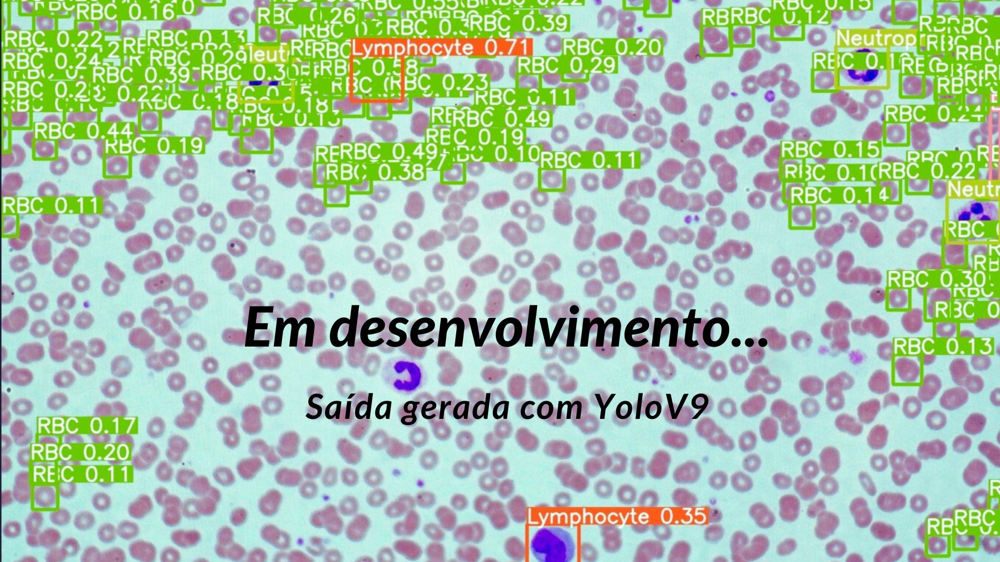

# Projeto de Mestrado: Desenvolvimento de um framework de redes neurais para análise de imagens de microscopia de esfregaço sanguíneo.

Quero compartilhar com minha rede um pouco mais sobre meu projeto de mestrado na **UFCSPA**: o desenvolvimento de um framework de **IA** para a análise automatizada de células sanguíneas em imagens microscópicas. Esse projeto é pessoalmente importante para mim e acredito que possa ter um impacto significativo na automação das análises clínicas, especialmente na hematologia.

## 🩸 O Desafio

Laboratórios de pequeno porte e regiões carentes ainda dependem de métodos manuais para a **contagem e classificação de leucócitos** em hemogramas — processos **demorados, custosos e suscetíveis a erros**. Além disso, equipamentos automatizados são inacessíveis para muitos, perpetuando desigualdades no acesso a diagnósticos precisos.

No livro _"Hemograma: Manual de Interpretação"_, de **Renato Failace**, amplamente utilizado como referência acadêmica, há uma passagem em que o autor descreve a prática de _"hemograma no ato"_, possibilitando a realização do exame durante a própria consulta. Quem sabe, com um desenvolvimento mais aprofundado deste projeto, essa prática possa se tornar viável a um custo acessível, especialmente na **medicina veterinária**, onde o acesso ao hemograma não é tão trivial quanto nos grandes complexos hospitalares.

## 🔬 A Solução

Estou construindo um modelo baseado em **redes neurais convolucionais** (ainda em fase de testes com diferentes arquiteturas) para **segmentar, contar e classificar células sanguíneas** a partir de imagens microscópicas. 

Equipamentos como o **CellaVision® DM1200** podem executar uma tarefa semelhante, mas sabemos que o custo desse tipo de tecnologia não é acessível para todos. O modelo será treinado com **conjuntos de dados públicos**, possivelmente complementados por imagens geradas pelo próprio **CellaVision DM96**, garantindo maior confiabilidade. 

A validação será feita por meio de **métricas robustas** (_precisão, recall, F1-Score_) e com a **avaliação de profissionais da área**, visando alcançar pelo menos **90% de acurácia**.

Na prática, esse sistema funcionará como um **equipamento laboratorial**, com interfaceamento e integração com **sistemas laboratoriais (LIS) via API REST**. Os resultados serão entregues em **JSON (ou ASTM/HL7)**, agilizando a análise laboratorial.

## 📈 Impacto Esperado

✔ **Redução de custos**: A automação de exames possibilita que **laboratórios com recursos limitados** realizem análises de forma mais eficiente. Além disso, a possibilidade de executar esse processo em **nuvem**, aliada a redes via satélite como a **Starlink**, viabiliza **diagnósticos rápidos e precisos em regiões remotas** ou comunidades carentes.

✔ **Soberania tecnológica**: Para mim, é essencial **desenvolvermos nossa própria tecnologia** e garantirmos a **soberania dos dados**, especialmente na área da saúde. Esse projeto busca criar uma solução **100% brasileira**, com potencial para futuras aplicações em **dispositivos médicos in vitro**, reduzindo a dependência de empresas estrangeiras.

## 📌 O Programa e os Próximos Passos

A metodologia escolhida para o desenvolvimento do modelo é o **CRISP-DM**, com adaptações necessárias para atender tanto às exigências de um **produto tecnológico** quanto aos requisitos acadêmicos de uma dissertação.

O projeto está sendo desenvolvido na **Universidade Federal de Ciências da Saúde de Porto Alegre (UFCSPA)**, dentro do programa de **Tecnologias da Informação e Gestão em Saúde (TIGSAÚDE)**, na linha de pesquisa em **sistemas inteligentes e aplicações na saúde**.

O programa tem um caráter **interdisciplinar**, proporcionando contato com profissionais de diversas áreas da saúde, como **médicos, gestores e especialistas de diferentes formações**, desde **física médica** até **fonoaudiologia**. Essa interação amplia a visão sobre os desafios da saúde e as tecnologias envolvidas.

A matriz curricular do curso permite aprofundar o conhecimento sobre **novas tecnologias e suas aplicações no setor da saúde**, por meio de disciplinas como:

- **Desenvolvimento de Softwares Baseado em Evidências**  
- **Tópicos Avançados em Tecnologias da Informação e Gestão em Saúde**  
- **Fundamentos da Inteligência Artificial Aplicada à Saúde**  

Ao final do projeto, a intenção é **disponibilizar o código-fonte no GitHub**, sob **licença Creative Commons**, incentivando a colaboração acadêmica e a adaptação pela comunidade.  

## 🤝 Vamos conversar?

Se você trabalha com **IA aplicada à saúde**, **análise de imagens médicas** ou tem interesse em colaborar, adoraria **trocar ideias!**  

Acompanhe o progresso e participe desta jornada por **diagnósticos mais acessíveis e precisos**.
